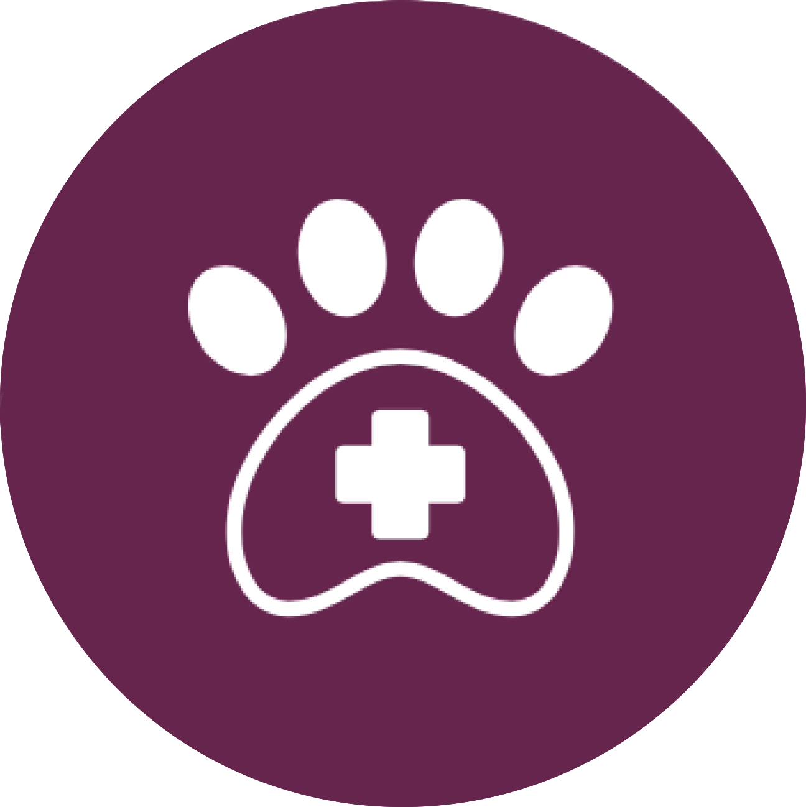
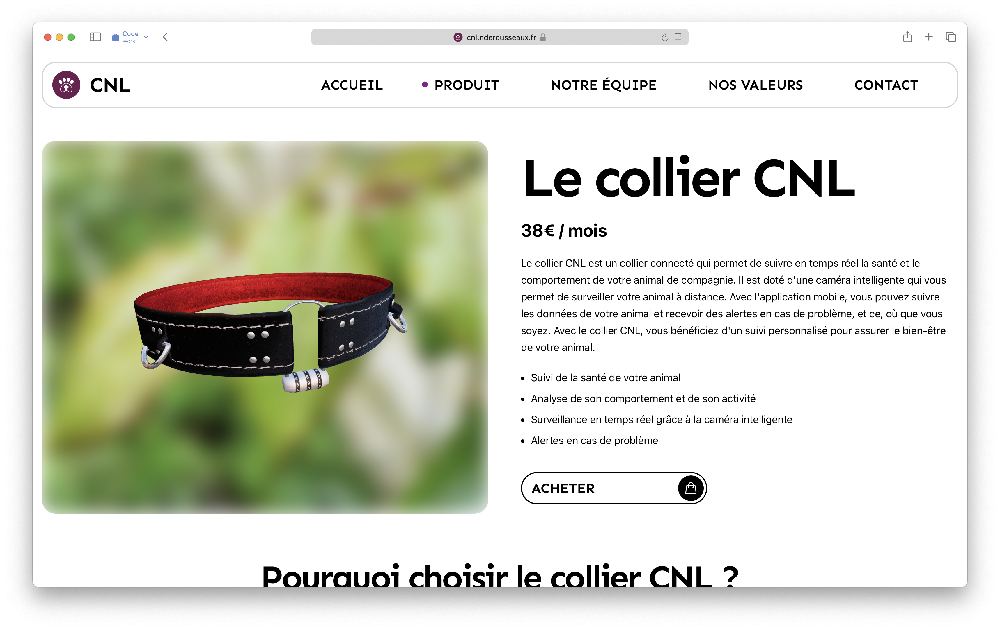
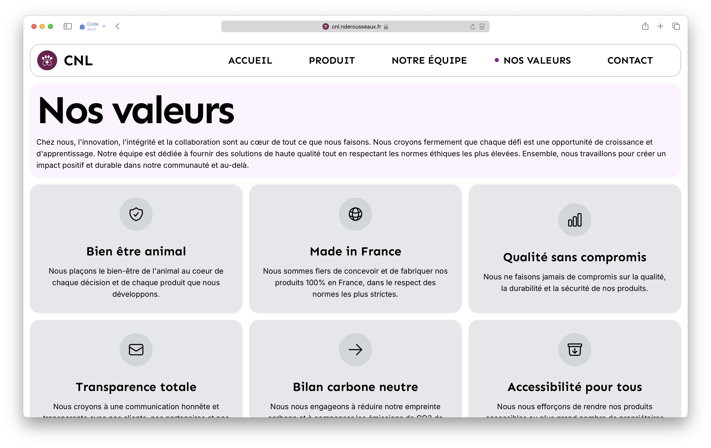
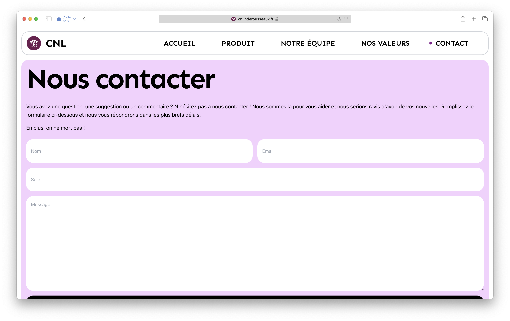
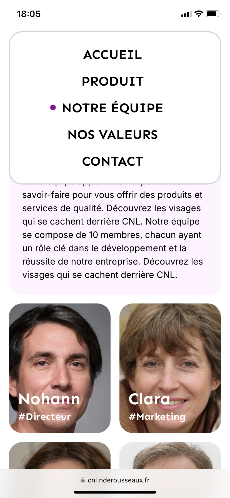
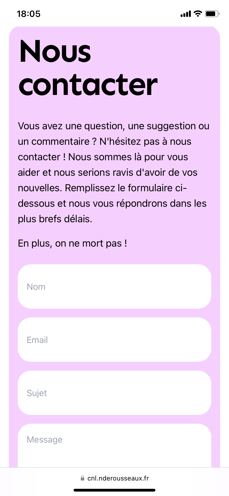

<p align="center">
	
</p>

<p align="center">
	
</p>

# <div align="center">CNL</div>
<div align="center">
	<samp>Découvrez le collier connecté CNL, une solution innovante pour le bien-être de votre animal.</samp>
</div>

<hr>


## ℹ️ About
CNL is a company that build a connected collar for pets. It is a collar that helps you to take care of your pet, by giving you information about his health and his activity. It is built with Next.js, Tailwind CSS and Vercel. Framer Motion is used for some animations, and three.js is used to display the collar in 3D. 

<p align="center">
	
</p>


## ✨ Features
- Home page
- Product page, with a 3D model of the collar
- Team page
- Value page
- Contact page


## 🚀 Tech Stack & Practices
This project implement the best practices of web app development : 
- Nested routing
- Server-side rendering (SSR)
- Dynamic rendering
- Responsive design
- Images and fonts optimization
- Accessibility
- SEO optimization
- Prepare to social sharing

## 🛠️ Getting started

### Installation

```bash
$ pnpm install
$ cp .env.example .env
```

### Development
```bash
$ pnpm run dev 
#or, with vercel
$ vercel dev
```

### Deployment
```bash
$ vercel --prod
```

Or simply push to the main branch, if you have the vercel integration enabled.


## 🌅 Some screenshots
<div>
	
	
	
	
	
	
	
</div>
